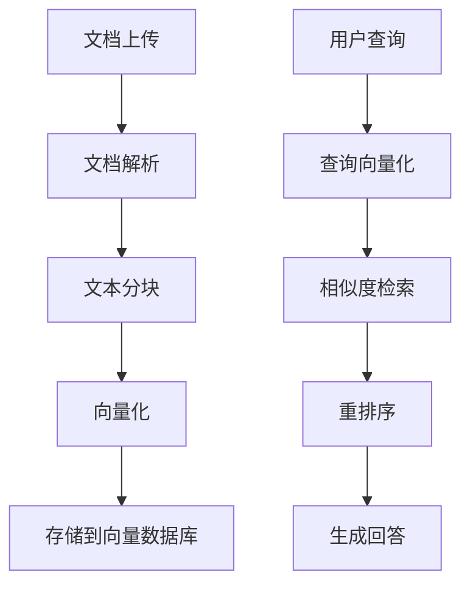

# Spring AI Alibaba Examples

[](https://opensource.org/licenses/Apache-2.0)
[](https://spring.io/projects/spring-ai)
[](https://spring.io/projects/spring-boot)
[](https://www.oracle.com/java/)

> 🔗 **相关链接**
> - **Spring AI Alibaba 主仓库**: https://github.com/alibaba/spring-ai-alibaba
> - **官方网站**: https://java2ai.com
> - **网站源码**: https://github.com/springaialibaba/spring-ai-alibaba-website

[English](./README-en.md) | 中文

## 📖 项目简介

Spring AI Alibaba Examples 是官方提供的综合示例仓库，展示了如何使用 Spring AI 和 Spring AI Alibaba 构建现代化的 AI 应用。本仓库采用模块化设计，涵盖从基础入门到企业级应用的完整技术栈，帮助开发者快速掌握 AI 集成开发的最佳实践。

### 🎯 核心特性

- **🚀 快速上手**: 提供 HelloWorld 示例，5分钟内验证环境配置
- **🌐 多平台支持**: 集成通义千问、OpenAI、Azure、DeepSeek、Moonshot 等主流 AI 平台
- **🎭 多模态处理**: 支持文本、音频、图像、视频的全方位 AI 能力
- **🤖 智能体开发**: 完整的 Agent 开发框架，支持 ReAct、Multi-Agent、Graph-based Workflow
- **📚 知识增强**: RAG（检索增强生成）与多种向量数据库深度集成
- **🔧 工具调用**: 让 AI 模型具备调用外部 API 和服务的能力
- **🔍 可观测性**: 集成 Langfuse、ARMS、Zipkin 提供完整的链路追踪和调试
- **🏗️ 企业级**: 支持 Nacos 配置管理、Higress 流量治理等企业级集成

## 🏗️ 技术架构

### 核心技术栈

| 组件 | 版本 | 说明 |
|------|------|------|
| **Java** | 17+ | 基础运行环境 |
| **Spring Boot** | 3.4.0 | 应用框架 |
| **Spring AI** | 1.0.0 | AI 集成框架 |
| **Spring AI Alibaba** | 1.0.0.3 | 阿里云 AI 能力增强 |
| **Maven** | 3.6+ | 项目构建工具 |
| **Docker** | - | 容器化部署 |

### 项目结构

```
spring-ai-alibaba-examples/
├── 🚀 spring-ai-alibaba-helloworld/              # HelloWorld 快速入门
├── 💬 spring-ai-alibaba-chat-example/            # 多平台聊天集成
│   ├── dashscope-chat/                          # 通义千问集成
│   ├── openai-chat/                             # OpenAI 集成
│   ├── azure-openai-chat/                       # Azure OpenAI 集成
│   ├── deepseek-chat/                           # DeepSeek 集成
│   ├── moonshot-chat/                           # 月之暗面集成
│   ├── ollama-chat/                             # Ollama 本地模型
│   ├── qwq-chat/                                # QwQ 模型集成
│   ├── vllm-chat/                               # vLLM 推理服务
│   └── zhipuai-chat/                            # 智谱AI 集成
├── 🎭 多模态处理/
│   ├── spring-ai-alibaba-audio-example/         # 音频处理示例
│   ├── spring-ai-alibaba-image-example/         # 图像处理示例
│   └── spring-ai-alibaba-video-example/         # 视频处理示例
├── 📚 spring-ai-alibaba-rag-example/             # 检索增强生成
│   ├── rag-pgvector-example/                    # PgVector 向量库
│   ├── rag-milvus-example/                      # Milvus 向量库
│   ├── rag-elasticsearch-example/               # Elasticsearch 集成
│   └── rag-etl-pipeline-example/                # ETL 数据管道
├── 🤖 spring-ai-alibaba-agent-example/          # 智能体开发
├── 🕸️ spring-ai-alibaba-graph-example/           # 图算法智能体
│   ├── react/                                   # ReAct 模式
│   ├── big-tool/                                # 大工具集成
│   ├── multiagent-openmanus/                    # 多智能体协作
│   └── human-node/                              # 人机交互节点
├── 🔗 spring-ai-alibaba-mcp-example/             # MCP 协议集成
├── 🛠️ spring-ai-alibaba-tool-calling-example/    # 工具调用示例
├── 📝 spring-ai-alibaba-prompt-example/          # 提示词工程
├── ⚙️ spring-ai-alibaba-nacos-prompt-example/   # Nacos 提示词管理
├── 🔍 spring-ai-alibaba-observability-example/   # 可观测性集成
├── 💾 spring-ai-alibaba-mem0-example/            # 会话记忆管理
├── 🗃️ spring-ai-alibaba-nl2sql-example/          # 自然语言转SQL
├── 🎯 spring-ai-alibaba-usecase-example/         # 实用场景示例
│   ├── text-classification/                     # 文本分类
│   ├── text-summarizer/                         # 文本摘要
│   ├── translate/                               # 文本翻译
│   └── comprehensive/                           # 综合实战案例
└── 🐳 docker-compose/                           # 基础设施服务
    ├── milvus/                                  # Milvus 向量数据库
    ├── pgvector/                                # PostgreSQL + pgvector
    ├── redis/                                   # Redis 缓存
    ├── mysql/                                   # MySQL 数据库
    ├── es/                                      # Elasticsearch
    └── ollama/                                  # Ollama 本地部署
```

## 🚀 快速开始

### 环境要求

- **JDK 17+**
- **Maven 3.6+**
- **Docker & Docker Compose** (可选，用于启动中间件)

### 1. 克隆项目

```bash
git clone https://github.com/springaialibaba/spring-ai-alibaba-examples.git
cd spring-ai-alibaba-examples
```

### 2. 安装依赖

由于 Spring AI Alibaba 需要手动安装到本地 Maven 仓库：

```bash
# 下载并安装 Spring AI Alibaba 到本地仓库
mvn install:install-file \
  -Dfile=<spring-ai-alibaba-jar-path> \
  -DgroupId=com.alibaba.cloud.ai \
  -DartifactId=spring-ai-alibaba-bom \
  -Dversion=1.0.0.3 \
  -Dpackaging=pom
```

### 3. 编译项目

```bash
# 使用 Makefile (推荐)
make compile

# 或使用 Maven
mvn clean compile
```

### 4. 运行 HelloWorld 示例

```bash
cd spring-ai-alibaba-helloworld

# 配置 API Key (在 application.yml 中)
# spring.ai.dashscope.api-key=your-api-key

# 启动应用
mvn spring-boot:run
```

访问 `http://localhost:8080` 开始体验！

## 📚 核心模块详解

### 💬 聊天集成 (Chat Examples)

展示如何集成不同的 AI 模型提供商：

- **通义千问 (DashScope)**: 阿里云官方大模型服务
- **OpenAI**: GPT 系列模型集成
- **Azure OpenAI**: 微软云 OpenAI 服务
- **DeepSeek**: 深度求索 AI 模型
- **Moonshot**: 月之暗面 Kimi 模型
- **Ollama**: 本地部署开源模型
- **智谱AI**: GLM 系列模型

### 📚 RAG 检索增强生成

完整的知识库问答解决方案：



支持的向量数据库：
- **PgVector**: PostgreSQL 扩展
- **Milvus**: 专业向量数据库
- **Elasticsearch**: 全文检索 + 向量检索
- **Redis**: 内存向量存储

### 🤖 智能体开发 (Agent Framework)

基于图算法的智能体开发框架：

- **ReAct 模式**: 推理-行动-观察循环
- **Multi-Agent**: 多智能体协作
- **Human-in-the-loop**: 人机协作模式
- **Tool Calling**: 工具调用能力
- **Workflow**: 复杂业务流程编排

### 🔗 MCP 协议支持

模型上下文协议 (Model Context Protocol) 集成：

- **MCP 客户端**: 连接 MCP 服务器
- **MCP 服务器**: 提供上下文服务
- **Nacos 集成**: 服务发现和配置管理
- **认证授权**: 安全访问控制

## 🛠️ 构建与部署

### 本地开发

```bash
# 编译全部模块
make compile

# 运行测试
make test

# 打包应用
make package

# 运行特定模块
cd spring-ai-alibaba-chat-example/dashscope-chat
mvn spring-boot:run
```

### Docker 部署

```bash
# 启动基础设施服务
docker-compose -f docker-compose/redis/docker-compose.yaml up -d
docker-compose -f docker-compose/milvus/docker-compose.yml up -d
docker-compose -f docker-compose/pgvector/docker-compose.yml up -d

# 构建和运行应用容器
cd spring-ai-alibaba-playground
docker build -t spring-ai-alibaba-playground .
docker run -p 8080:8080 spring-ai-alibaba-playground
```

### 生产环境配置

推荐的生产环境配置：

```yaml
# application-prod.yml
spring:
  profiles:
    active: prod
  ai:
    dashscope:
      api-key: ${DASHSCOPE_API_KEY}
      base-url: ${DASHSCOPE_BASE_URL:https://dashscope.aliyuncs.com}
    retry:
      max-attempts: 3
      backoff:
        initial-interval: 1s
        max-interval: 10s

management:
  endpoints:
    web:
      exposure:
        include: health,info,metrics
  endpoint:
    health:
      show-details: when-authorized
```

## 🎯 使用场景示例

### 1. 智能客服系统

```java
@RestController
public class CustomerServiceController {
    
    @Autowired
    private ChatClient chatClient;
    
    @PostMapping("/chat")
    public String chat(@RequestBody String message) {
        return chatClient.prompt()
            .user(message)
            .call()
            .content();
    }
}
```

### 2. 文档问答系统

```java
@Service
public class DocumentQAService {
    
    @Autowired
    private VectorStore vectorStore;
    
    public String searchDocuments(String query) {
        List<Document> similarDocs = vectorStore
            .similaritySearch(query);
        return generateAnswer(query, similarDocs);
    }
}
```

### 3. 智能数据分析

```java
@Component
public class DataAnalysisAgent {
    
    @Function("Execute SQL query")
    public String executeQuery(String naturalLanguage) {
        String sql = nl2SqlConverter.convert(naturalLanguage);
        return databaseExecutor.execute(sql);
    }
}
```

## 📊 性能优化

### 连接池配置

```yaml
spring:
  ai:
    dashscope:
      chat:
        options:
          temperature: 0.7
          max-tokens: 2048
        http:
          connection-timeout: 10s
          read-timeout: 60s
          max-connections: 50
```

### 缓存策略

```java
@Service
@EnableCaching
public class CachedChatService {
    
    @Cacheable(value = "chat-responses", key = "#message")
    public String chat(String message) {
        return chatClient.call(message);
    }
}
```

## 🔍 可观测性

### 集成 Langfuse

```yaml
spring:
  ai:
    observability:
      langfuse:
        api-key: ${LANGFUSE_API_KEY}
        base-url: ${LANGFUSE_BASE_URL}
        enabled: true
```

### 自定义监控

```java
@Component
public class CustomObservationHandler implements ObservationHandler<ChatModelObservationContext> {
    
    @Override
    public void onStart(ChatModelObservationContext context) {
        // 记录请求开始时间
        context.put("startTime", System.currentTimeMillis());
    }
    
    @Override
    public void onStop(ChatModelObservationContext context) {
        // 记录请求耗时和结果
        long duration = System.currentTimeMillis() - 
            (Long) context.get("startTime");
        metricsCollector.recordLatency(duration);
    }
}
```

## 🤝 如何贡献

我们欢迎任何形式的贡献！请查看 [CONTRIBUTION.md](./CONTRIBUTION.md) 了解详细的贡献指南。

### 贡献类型

- 🐛 **Bug 修复**: 修复现有问题
- ✨ **新功能**: 添加新的示例模块
- 📝 **文档改进**: 完善文档和注释
- 🎨 **代码优化**: 提升代码质量
- 🧪 **测试增强**: 添加单元测试和集成测试

### 提交流程

1. Fork 项目到你的 GitHub 账号
2. 创建功能分支: `git checkout -b feature/your-feature`
3. 提交改动: `git commit -am 'Add some feature'`
4. 推送分支: `git push origin feature/your-feature`
5. 创建 Pull Request

## 📞 社区支持

- 🌐 **官方网站**: https://java2ai.com
- 📖 **文档中心**: https://java2ai.com/docs
- 💬 **问题反馈**: [GitHub Issues](https://github.com/springaialibaba/spring-ai-alibaba-examples/issues)
- 🔗 **主项目**: https://github.com/alibaba/spring-ai-alibaba

## 📄 许可证

本项目基于 [Apache License 2.0](LICENSE) 开源协议发布。

---

<div align="center">
  <strong>🎉 开始你的 AI 开发之旅吧！</strong><br>
  <sub>如果这个项目对你有帮助，请给我们一个 ⭐️</sub>
</div>
